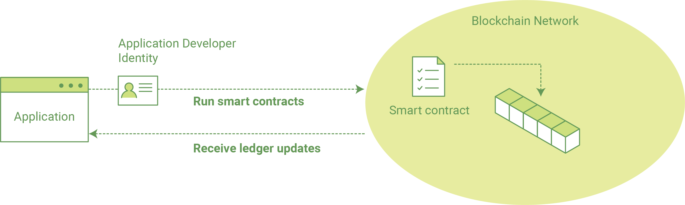
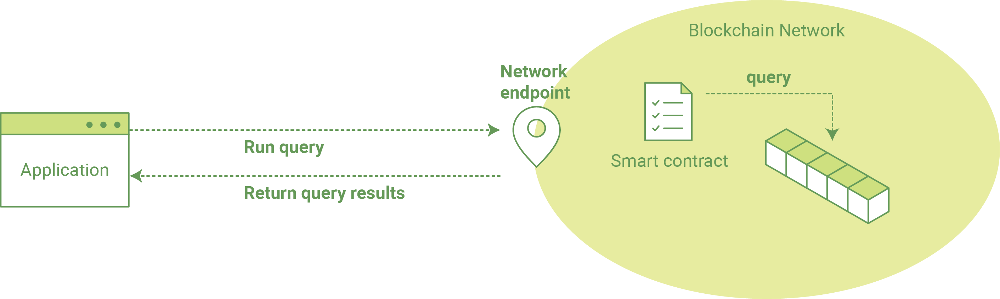
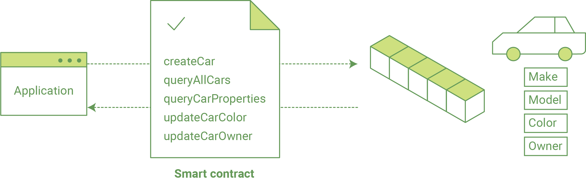

# Writing Your First Application
在Hyperledger Fabric network中书写你的第一个程序.

在最基本的层面上，在blockchain网络中应用是怎么让用户查询分类（根据所包含的特定记录），或更新（添加记录）。

我们的程序中，包括Javascript，使用node.js与网络进行交互（前提是必须存在账本），指导完成第一个应用程序的3个步骤。

    1. 测试hyperledger fabric 的网络启动，我们需要一些特定的基本组件，方便查询和更新账本，组件包括“
    peer node, ordering node and Certificate Authority – 充当我们的主要组件; 我们还将有一个用于管理命令的CLI容器。单个脚本将下载并启动此测试网络。

    2. 学习智能合约的的示例参数，我们的程序将会使用到. 我们的智能合约包含各种功能，允许我们以不同的方式与分类账进行交互，例如：读取精确的数据和整体数据。

    3. 开发应用程序，以便能够查询和更新记录。我们提供两个示例应用程序，一个用于查询分类账，另一个用于更新。我们的应用程序将使用SDK API与网络进行交互，并最终调用这些函数。 

首先，启动测试网络...

## Getting a Test Network

确认前置依赖条件都已经具备。

确定一个工作目录，然后clone数据到本地，进入fabcar..

    git clone https://github.com/hyperledger/fabric-samples.git
    cd fabric-samples/fabcar

这个子目录–fabcar–包含脚本和应用程序代码运行的示例应用程序，ls一下。您应该看到以下内容： 

    chaincode    invoke.js       network         package.json    query.js        startFabric.sh

现在使用startFabric.sh 来启动.

    ./startFabric.sh

该脚本大致步骤如下:

    1.启动 peer node, ordering node, Certificate Authority and CLI container
    2.creates a channel and joins the peer to the channel
    3.installs smart contract (i.e. chaincode) onto the peer’s file system and instantiates said chaincode on the channel; instantiate starts a chaincode container
    4.calls the initLedger function to populate the channel ledger with 10 unique cars

有了网络和示例代码之后，来研究一下，不同部分是如何组合在一起的。
## How Applications Interact with the Network

应用程序使用的API调用智能合同（简称“chaincode”）。这些智能合约托管在网络中，并通过名称和版本进行标识。例如，我们的链码容器为dev-peer0.org1.example.com-fabcar-1.0，版本是1.0，同时运行的是dev-peer0.org1.example.com。

API可以通过软件开发工具包（SDK）访问。这个练习的目的，我们将使用hyperledger fabric SDK虽然也有一个java sdk和CLI可以用来开发应用程序。

## Querying the Ledger
查询是如何从分类帐中读取数据的。您可以查询单个键或者多个键的值，如果分类帐是用JSON这样的丰富数据存储格式编写的，那么可以对它执行复杂的搜索（例如，查找包含某些关键字的所有资产）。

在查看该应用程序如何工作之前，我们需要安装SDK节点模块以便程序运行。从你的fabcar目录，问题如下：

    npm install

现在可以运行程序来查询了：

    node query.js

返回如下列:

    Query result count =  1
    Response is  [{"Key":"CAR0", "Record":{"colour":"blue","make":"Toyota","model":"Prius","owner":"Tomoko"}},
    {"Key":"CAR1",   "Record":{"colour":"red","make":"Ford","model":"Mustang","owner":"Brad"}},
    {"Key":"CAR2", "Record":{"colour":"green","make":"Hyundai","model":"Tucson","owner":"Jin Soo"}},
    {"Key":"CAR3", "Record":{"colour":"yellow","make":"Volkswagen","model":"Passat","owner":"Max"}},
    {"Key":"CAR4", "Record":{"colour":"black","make":"Tesla","model":"S","owner":"Adriana"}},
    {"Key":"CAR5", "Record":{"colour":"purple","make":"Peugeot","model":"205","owner":"Michel"}},
    {"Key":"CAR6", "Record":{"colour":"white","make":"Chery","model":"S22L","owner":"Aarav"}},
    {"Key":"CAR7", "Record":{"colour":"violet","make":"Fiat","model":"Punto","owner":"Pari"}},
    {"Key":"CAR8", "Record":{"colour":"indigo","make":"Tata","model":"Nano","owner":"Valeria"}},
    {"Key":"CAR9", "Record":{"colour":"brown","make":"Holden","model":"Barina","owner":"Shotaro"}}]
10辆车返回的结果。

使用atom或者visual studio打开query.js.

初始化过程中定义了chaincode ID ， channel name 和 网络连接点的环境变量

    var options = {
        wallet_path : path.join(__dirname, './network/creds'),
        user_id: 'PeerAdmin',
        channel_id: 'mychannel',
        chaincode_id: 'fabcar',
        network_url: 'grpc://localhost:7051',

查询如下：

    // queryCar - requires 1 argument, ex: args: ['CAR4'],
    // queryAllCars - requires no arguments , ex: args: [''],
    const request = {
    chaincodeId: options.chaincode_id,
    txId: transaction_id,
    fcn: 'queryAllCars',
    args: ['']

我们定义的chaincode_id变量为fabcar–允许我们对特定的链码–然后调用queryallcars内链码定义的函数。

当我们节点发出query.js命令，这一特定的函数被称为查询分类。然而，这并不是我们能传递的唯一功能。 

看看其他的，在链码的子目录里使用编辑器打开fabcar.go， 将会看到以下功能可以使用，initLedger, queryCar, queryAllCars, createCar and changeCarOwner. 让我看来看一下 queryAllCars 和总账之间的关系.

    func (s *SmartContract) queryAllCars(APIstub shim.ChaincodeStubInterface) sc.Response {

        startKey := "CAR0"
        endKey := "CAR999"

        resultsIterator, err := APIstub.GetStateByRange(startKey, endKey)

该函数使用shim接口函数的`GetStateByRange`返回`startKey and endKey`之间的总账数据。这些键分别被定义为`CAR0`,`CAR999`,理论上我们可以创造100辆车，`queryAllCars`将揭露每一个。

下面是一个表示如何一个应用程序会调用不同的功能码。

我们可以看到我们的`queryallcars`功能上面，还有一位叫`createcar`将允许我们更新总账最终追加新块链。但是首先，让我们做另一个查询。

回到`query.js`程序和编辑构造函数要求查询某一辆车。我们将通过改变函数来`querycar` `queryallcars`并传递给`args`参数的一个特定的“Key”。所以,我们编辑的query.js程序现在应该包含以下：

    const request = {
        chaincodeId: options.chaincode_id,
        txId: transaction_id,
        fcn: 'queryCar',
        args: ['CAR4']

保存后执行查询：

    node query.js

返回结果如下:

    {"colour":"black","make":"Tesla","model":"S","owner":"Adriana"}

所以我们已经从查询所有车辆更改到只查询一辆，Adriana的黑色特斯拉Model S采用querycar功能，可以查询任意键（例如car0）和得到什么，模型，颜色，和主人对应的车。

非常好.现在你应该舒服的链码的基本查询功能，在查询程序的一些参数。更新分类帐的时间… 

## Updating the Ledger

现在我们已经完成了一些分类账查询并添加了一些代码，我们已经准备好更新分类帐了。我们可以做很多潜在的更新，但是让我们为初学者创建一个新的汽车。

分类帐更新从一个生成交易建议的应用程序开始。就像查询一样，构造一个请求来标识用于事务的通道ID、函数和特定的智能合约。然后程序调用`channel.sendtransactionproposal` API发送交易到peer（s）并且进行背书。 

网络（即支持对等点）返回一个建议响应，应用程序使用它来构建和签署一个事务请求。这个请求是通过调用channel.sendtransaction API发送到orderer服务。orderer服务将事务捆绑成块，然后将块“传递”到通道上的所有对等点进行验证。（在我们的例子中，我们只有一个支持的对等点）。

最后应用程序使用`eh.setPeerAddr`对事件的节点进行端口侦听，并且，调用`eh.registerTxEvent`去登记与特定事务ID，这个API允许应用程序知道一笔交易的结果（即成功提交或不成功）。把它看作一种通知机制。

我们最初调用的目标是简单地创建一个新资产（在这种情况下是CAR）。我们有一个单独的`JavaScript`程序`invoke.js` -我们将使用这些交易。就像查询，使用编辑器打开程序，浏览到我们建设的调用在代码块： 

    // createCar - requires 5 args, ex: args: ['CAR11', 'Honda', 'Accord', 'Black', 'Tom'],
    // changeCarOwner - requires 2 args , ex: args: ['CAR10', 'Barry'],
    // send proposal to endorser
    var request = {
        targets: targets,
        chaincodeId: options.chaincode_id,
        fcn: '',
        args: [''],
        chainId: options.channel_id,
        txId: tx_id

你会看见2个函数定义 - `createCar` or `changeCarOwner`. 让我们创建一个红色雪佛兰福特给 Nick.当前账本到CAR9,所以我们将使用 `CAR10` 做为识别字段. 更新后应该如下:

    var request = {
        targets: targets,
        chaincodeId: options.chaincode_id,
        fcn: 'createCar',
        args: ['CAR10', 'Chevy', 'Volt', 'Red', 'Nick'],
        chainId: options.channel_id,
        txId: tx_id

保存并执行：

    node invoke.js

输出如下信息:

    The transaction has been committed on peer localhost:7053

调用`query.js`查询，将得到如下信息：

    Response is  {"colour":"Red","make":"Chevy","model":"Volt","owner":"Nick"}

最后，我们给我们的最后一个功能`changecarowner`。Nick感觉很慷慨，他想把他的雪佛兰伏特给一个叫巴里的人。所以，我们只需编辑`invoke.js`反映以下： 

var request = {
   targets: targets,
   chaincodeId: options.chaincode_id,
   fcn: 'changeCarOwner',
   args: ['CAR10', 'Barry'],
   chainId: options.channel_id,
   txId: tx_id

执行后再次查询结果如下：

    Response is  {"colour":"Red","make":"Chevy","model":"Volt","owner":"Barry"}

Additional Resources

