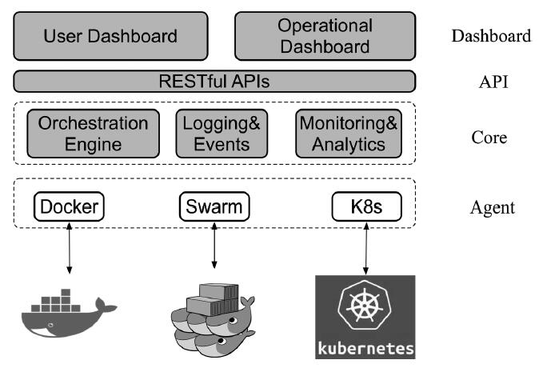
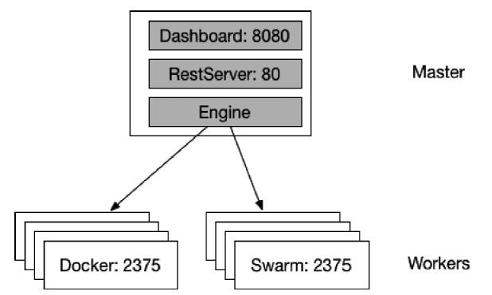
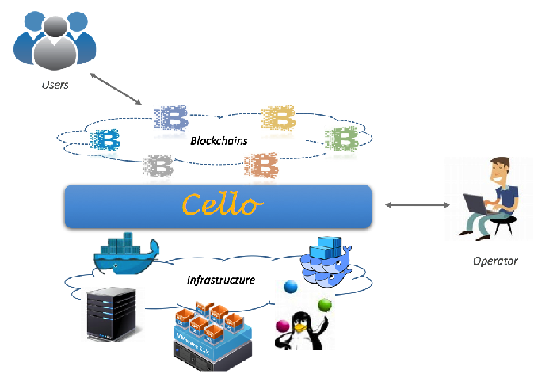

## 区块链平台设计

### Baas 

区块链即服务（Blockchain as a Service，BaaS），是部署在云计算基础设施之上，对外提供区块链网络的生命周期管理和运行时服务管理等功能的一套工具。

构建一套分布式的区块链方案绝非易事，既需要硬件基础设施的投入，也需要全方位的开发和运营管理（DevOps）。BaaS作为一套工具，可以帮助开发者快速生成必要的区块链环境，进而验证所开发的上层应用。

除了区块链平台本身，一套完整的解决方案实际上还可以包括设备接入、访问控制、服务监控等管理功能。这些功能，让BaaS平台可以为开发者提供更强大的服务支持。

图给出了区块链即服务功能的参考架构，自上而下分为多层结构。最上层面向应用开发者和平台管理员提供不同的操作能力；核心层负责完成包括资源编排、系统监控、数据分析和权限管理等重要功能；下层可以通过多种类型的驱动和代理组件来访问和管理多种物理资源。

### BaaS平台所提供的业务能力通常包括：

    ·用户按需申请区块链网络，以及所需的计算、存储与网络连接资源；
    ·用户对申请到的区块链进行生命周期管理，甚至支持灵活、弹性的区块链配置；
    ·通过提供接口，让用户自由访问所申请到的区块链网络并进行调用；
    ·提供直观的区块链可视化监控与操作界面，将区块链应用与底层平台无缝对接；
    ·提供简单易用的智能合约开发与测试环境，方便用户对应用代码进行管理；
    ·为管理员提供用户管理和资源管理操作；
    ·为管理员提供对系统各项健康状态的实时监控；
    ·提供对平台内各项资源和应用层的数据分析和响应能力。

### 考量指标

对于BaaS服务提供方，搭建这样一套功能完善、性能稳定的BaaS平台存在诸多挑战。可以从如下几个角度进行考量设计：

    ·性能保障：包括区块链和应用的响应速度，监控实时性等；
    ·可扩展性：支持大规模场景下部署和管理的能力，可以快速进行扩展；
    ·资源调度：对于非均匀的资源请求类型可以智能的予以平缓化处理，合理分配系统资源；
    ·安全性：注意平衡用户操作区块链的自由度与平台自身的安全可控；
    ·可感知性：深度感知数据行为，如可以准确实时评估区块链的运行状况，给用户启发；
    ·底层资源普适性：底层应当支持多种混合计算架构，容易导入物理资源。

此外，对于面向开发者的BaaS服务，创建的区块链环境应当尽量贴近实际应用场景，让用户可以将经过检验的区块链模型很容易地迁移到生产环境。甚至可以直接联动支持第三方发布平台，直接将经过验证的应用推向发布环境。

## 使用Cello搭建区块链服务

Cello项目的定位为区块链管理平台，支持部署、运行时管理和数据分析等功能，可以实现一套完整的BaaS系统的快速搭建。其基本架构如图所示。

在实现区块链环境快速部署的同时，Cello也提供了不少对区块链平台进行运行时管理的特性，这些特性总结如下：

    ·管理区块链的全生命周期，包括创建、配置、使用、健康检查、删除等；
    ·支持多种基础架构作为底层资源池，包括裸机、虚拟机、容器云（Docker、Swarm、Kubernetes）等；
    ·支持多种区块链平台及自定义配置（目前以支持超级账本Fabric为主）；
    ·支持监控和分析功能，实现对区块链网络和智能合约的运行状况分析；
    ·提供可插拔的框架设计，包括区块链平台、资源调度、监控、驱动代理等都很容易引入第三方实现。

## 环境准备

Cello采用了典型的主从（Master-Worker）架构。用户可以自行准备一个Master物理节点和若干个Worker节点。其中，Master节点负责管理（例如，创建和删除）Worker节点中的区块链集群，通过8080端口对外提供网页Dashboard，通过80端口对外提供RESTful API。Worker节点负责提供区块链集群的物理资源，例如基于Docker主机或Swarm的方式启动多个集群，作为提供给用户可选的多个区块链网络环境。

展示了一个典型的Cello部署拓扑。每个节点默认为Linux（如Ubuntu16.04）服务器或虚拟机。

为了支持区块链网络，Worker和Master节点需要配备足够的物理资源。例如，如果希望在一个Worker节点上能够启动至少10个区块链集群，则建议节点配置至少为8 CPU、16G内存、100G硬盘容量。

#### System Requirement

    Hardware: 8c16g100g
    Docker engine: 1.10.0~1.13.0 (Docker 17.0+ support is experimental)
    docker-compose: 1.8.0~1.12.0

#### Clone Code

    git clone https://github.com/hyperledger/cello && cd cello

#### Setup Master

    make setup-master 
    make logs

#### Usage
    Start/Stop/Restart
        make start
    Redploy a service
        make redeploy service=dashboard
    Check Logs
        make logs
        make log service=watchdog
    Configuration
        The application configuration can be imported from file named CELLO_CONFIG_FILE.
        By default, it also loads the config.py file as the configurations.
    Data Storage
        The mongo container will use local /opt/cello/mongo path (Must exist locally) for persistent storage.
        Please keep it safe by backups or using more high-available solutions.
#### Setup Worker 

Update /lib/systemd/system/docker.service like

    [Service]
    DOCKER_OPTS="$DOCKER_OPTS -H tcp://0.0.0.0:2375 -H unix:///var/run/docker.sock --api-cors-header='*' --default-ulimit=nofile=8192:16384 --default-ulimit=nproc=8192:16384"
    EnvironmentFile=-/etc/default/docker
    ExecStart=
    ExecStart=/usr/bin/dockerd -H fd:// $DOCKER_OPTS

    $ sudo systemctl daemon-reload
    $ sudo systemctl restart docker.service

Setup
    make setup-worker
    sysctl -w net.ipv4.ip_forward=1

#### Host

Add Host
点击一个主机的Action下拉菜单，有如下选项可供操作该主机：

    ·Fillup：将主机运行的区块链数添加至上限；
    ·Clean：清理主机中所有未被用户占用的链；
    ·Config：更改主机配置，如名称和链数量上限；
    ·Reset：重置该主机，只有当该主机没有用户占用的链时可以使用；
    ·Delete：从资源池中删除该主机。

#### Active Chains
页面会显示所有正在运行的链，包括链的名称、类型、状态、健康状况、规模、所属主机等信息。正在被用户占用的链会用灰色背景标识

# 不完整待测试

部署没问题，需要调整 证书的path，但是监控的blockchain-explorer 容器会出问题，需要进一步验证。