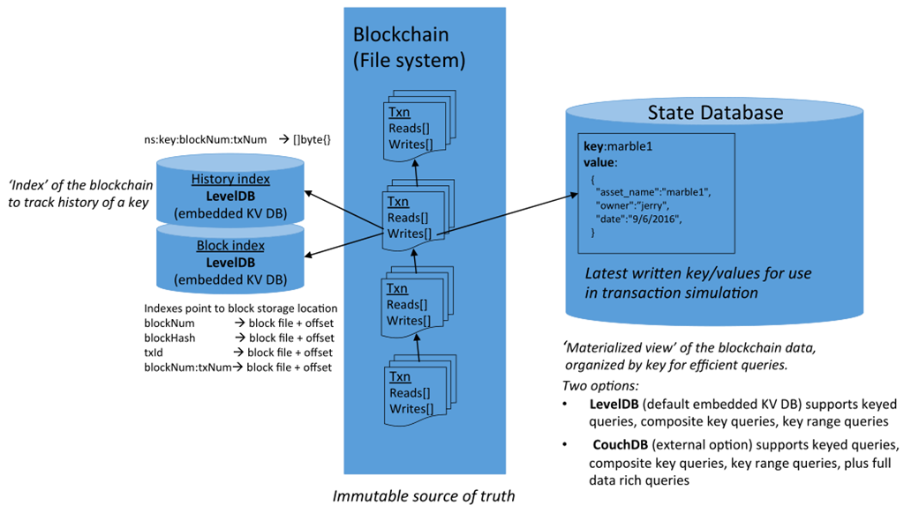

# Setup E2E CouchDB

## 解析
fabric 1.0 中有3种类型的数据存储，一种是文件系统方式的区块链数据（类似比特币），在Fabric 1.0中的区块链存储了Transaction订单读写集，而这个读写集读什么？写什么？其实就是State Database，也叫作World State。以键值对的形式存储了Chaincode中操作的业务数据。另外还有就是对历史数据和区块链索引的数据库。

> The Pic Form Network

区块链是文件系统，目前不支持更改，历史数据和区块链的索引是LevelDB，也不支持更改。而State Database是直接和业务相关的，所以提供了替换数据库，当前仅支持LevelDB和可选择的CouchDB。

CouchDB不一定是最优秀的，只是fabric相对开发资源有限，1.0的时候仅选择了CouchDB，其实很多人也考也Mysql或者MongoDB。

### 部署规划
CouchDB是一个完全局域RESTful API的键值数据库，可以不需要任何客户端，只需要通过HTTP请求就可以操作数据库了。LevelDB是Peer的本地数据库，那么肯定是和Peer一对一的关系，那么CouchDB是个网络数据库，应该和Peer是什么样一个关系呢？在生产环境中，我们会为每个组织部署节点，而且为了高可用，可能会在一个组织中部署多个Peer。同样我们在一个组织中也部署多个CouchDB，每个Peer对应一个CouchDB。

### 必要条件
完整的E2E环境部署后并没有包含CouchDB，需要在使用脚本启动的时候添加couchdb参数。

    1:停止已经启动的E2E环境
    ./network_setup.sh down
    2:启动CouchDB
    ./network_setup.sh up mychannel 60 couchdb

### 部署CouchDB工作连
