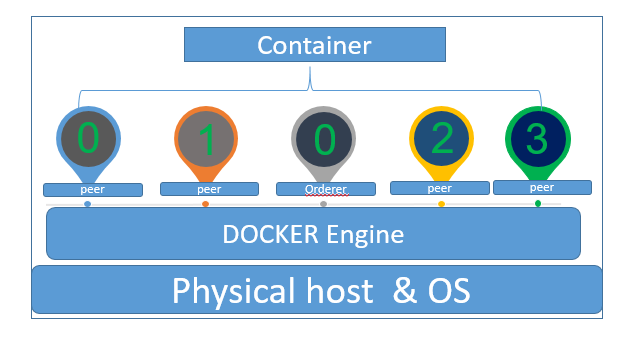
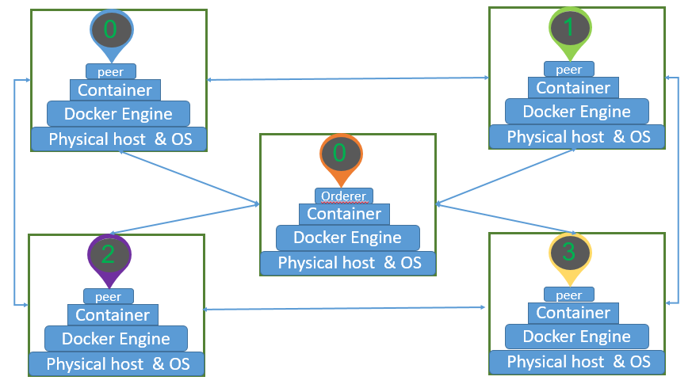

E2E Deployment Model
=====================================

### Single Node Model

>The Pic from network

#### Singe Node Deployment :
  fabric 提供的E2E测试示例部分单节点结构实际是由单独的docker容器来完成，示例中，peer0和peer1隶属于org1节点；peer2和peer3隶属于org2节点，这些节点都加入在相同的channel中进行交易，而orderer则为该channel中的交易提供排序服务。

  ###  Multi Node Model

#### Multi Node Deployment:
E2E的示例相对来讲还是比较简单的，但是现实中无法这样运作，实际场景中，所有节点可能会由不同的组织分别使用和维护，所以peer和orderer节点必然不会再同一物理机上。
