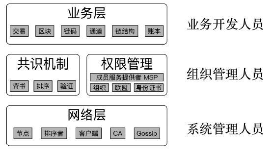
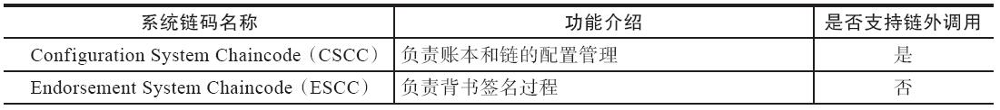
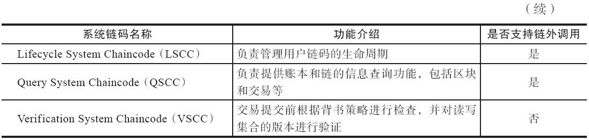
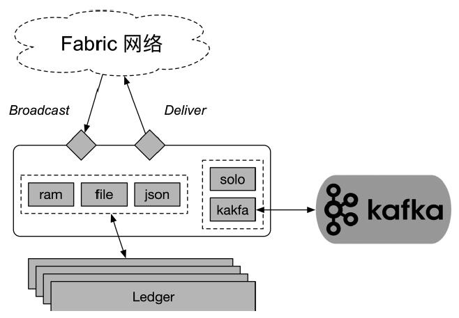

## 核心概念与组件

>知其然，进而可以知其所以然。

要理解Fabric设计，需要先掌握节点、交易、排序、共识、通道等基本组件的核心概念。

高度模块化的设计：

fabric 面向不同开发人员提供了不同层面的功能，自下而上分为3层：

    · 网络层：面向系统管理人员。实现P2P网络，提供底层构建区块链网络的基本能力，包括代表不同角色的节点和服务。
    · 共识机制和权限管理：面向联盟和组织的管理人员。基于网络层的连通，实现共识机制和权限管理，提供分布式账本的基础。
    · 业务层：面向业务应用开发人员。基于分布式账本，支持链码、交易等跟业务相关的功能模块，提供更高一层的应用开发支持。

### 网络
网络层通过软、硬件设备，实现了对分布式账本结构的连通支持，包括节点、排序者、客户端等参与角色，还包括成员身份管理、Gossip协议等支持组件。

1. 节点

节点（Peer）的概念最早来自于P2P分布式网络，意味着在网络中担任一定职能的服务或软件。节点功能可能是对等一致的，也可能是分工合作的。

在超级账本Fabric网络中，Peer意味着在网络中负责接收交易请求、维护一致账本的各个fabric-peer实例。这些实例可能运行在裸机、虚拟机甚至容器中。节点之间彼此通过gRPC消息进行通信。
按照功能角色划分，Peer可以包括三种类型：

        · Endorser（背书节点）：负责对来自客户端的交易提案进行检查和背书；
        · Committer（确认节点）：负责检查交易请求，执行交易并维护区块链和账本结构；
        · Submitter（提交节点）：负责接收交易，转发给排序者，目前未单独出现。

这些角色是功能上的划分，彼此并不相互排斥。一般情况下，网络中所有节点都具备Committer功能，部分节点具有Endorser功能，Submitter功能则往往集成在客户端（SDK）实现。

2. 排序者

排序者（Orderer）也称为排序节点，负责对所收到的交易在网络中进行全局排序。

Orderer可以支持多通道。不同通道之间彼此隔离，通道内交易相关信息将仅发往加入通道内的Peer（同样基于gRPC消息），从而提高隐私性和安全性
。
在目前的设计中，所有的交易信息都会从Orderer经过，因此，Orderer节点在网络中必须处于可靠、可信的地位。

从功能上看，Orderer的目的是对网络中的交易分配全局唯一的序号，实际上并不需要交易相关的具体数据内容。因此为了进一步提高隐私性，发往Orderer的可以不是完整的交易数据，而是部分信息，比如交易加密处理后的结果，或者仅仅是交易的Hash值、Id信息等。这些改进设计会降低对Orderer节点可靠性和安全性的需求。社区目前也已经有了一些类似的设计讨论。

3. 客户端

客户端是用户和应用跟区块链网络打交道的桥梁。客户端主要包括两大职能：
        
    ·操作Fabric网络：包括更新网络配置、启停节点等；
    ·操作运行在网络中的链码：包括安装、实例化、发起交易调用链码等。

这些操作需要跟Peer节点和Orderer节点打交道。特别是链码实例化、交易等涉及共识的操作，需要跟Orderer交互，因此，客户端往往也需要具备Submitter的能力。

网络中的Peer和Orderer等节点则对应提供了gRPC远程服务访问接口，供客户端进行调用。

目前，除了基于命令行的客户端之外，超级账本Fabric已经拥有了多种语言的SDK。这些SDK封装了对底层gRPC接口的调用，可以提供更完善的客户端和开发支持，包括Node.Js、Python、Java、Go等多种实现。

4. 成员身份管理

CA节点（Fabric-CA）负责对Fabric网络中的成员身份进行管理。

Fabric网络目前采用数字证书机制来实现对身份的鉴别和权限控制，CA节点则实现了PKI服务，主要负责对身份证书进行管理，包括生成、撤销等。

需要注意的是，CA节点可以提前签发身份证书，发送给对应的成员实体，这些实体在部署证书后即可访问网络中的各项资源。后续访问过程中，实体无须再次向CA节点进行请求。因此，CA节点的处理过程跟网络中交易的处理过程是完全解耦的，不会造成性能瓶颈。

通过基于PKI的成员身份管理，Fabric网络可以对接入的节点和用户的各种能力进行限制。

Fabric设计中考虑了三种类型的证书：登记证书（Enrollment Certificate）、交易证书（Transaction Certificate），以及保障通信链路安全的TLS证书。证书的默认签名算法为ECDSA，Hash算法为SHA-256：

    ·登记证书（ECert）：颁发给提供了注册凭证的用户或节点等实体，一般长期有效；
    ·交易证书（TCert）：颁发给用户，控制每个交易的权限，一般针对某个交易，短期有效；
    ·通信证书（TLSCert）：控制对网络层的接入访问，可以对远端实体身份进行校验，防止窃听。

目前，在实现上，主要通过ECert来对实体身份进行检验，通过检查签名来实现权限管理。TCert功能暂时未启用。

权限策略，负责对通道内数据的各种操作权限进行管理。一般包括对读身份（Readers，例如获取通道的交易、区块等数据）、写身份（Writers，例如向通道发起交易）、管理员身份（Admins，例如加入通道、修改通道的配置信息）等权限进行限制。

操作者通过签名组合满足了指定的规则，则证明拥有了对应的权限身份，允许执行相应的操作。

5. Gossip协议

Fabric网络中的节点之间通过Gossip协议来进行状态同步和数据分发。

Gossip协议是P2P领域的常见协议，用于进行网络内多个节点之间的数据分发或信息交换。由于其设计简单，容易实现，同时容错性比较高，而被广泛应用到了许多分布式系统，例如Cassandra采用它来实现集群失败检测和负载均衡。

Gossip协议的基本思想十分简单，数据发送方从网络中随机选取若干节点，将数据发送过去；接收方重复这一过程（往往只选择发送方之外节点进行传播）。这一过程持续下去，网络中所有节点最终（时间复杂度为节点总个数的对数）都会达到一致。数据传输的方向可以是发送方发送或获取方拉取。

在Fabric网络中，节点会定期地利用Gossip协议发送它看到的账本的最新数据，并对发送消息进行签名认证。通过使用该协议，主要实现如下功能：

    ·通道内成员的探测：新加入通道的节点可以获知其他节点的信息，并发送Alive信息宣布在线；离线节点经过一段时间后可以被其他节点感知。
    ·节点之间同步数据：多个节点之间彼此同步数据，保持一致性。另外，Leader节点从Orderer拉取区块数据后，也可以通过Gossip传播给通道内其他节点。

### 共识

共识（consensus）来自于分布式系统领域。

在Fabric中，共识过程意味着多个Peer节点对于某一批交易的发生顺序、合法性以及它们对账本状态的更新结果达成一致的观点。满足共识则意味着多个节点可以始终保证相同的状态，对于以同样顺序到达的交易可以进行一致的处理。

具体来看，Fabric中的共识包括背书、排序和验证三个环节的保障。

1. 背书过程

背书（endorsement）是指背书节点对收到的来自客户端的请求（交易提案）按照自身的逻辑进行检查，以决策是否予以支持的过程。

通常情况下，背书过程意味着背书节点对请求提案和造成的状态变更（读写集）添加数字签名。

对于调用某个链码的交易来讲，它需要获得一定条件的背书才被认为合法。例如必须是来自某些特定身份成员的一致同意；或者某个组织中超过一定数目的部分成员的支持；或者指定的某个成员个体的支持。这些规则由链码的背书策略来指定。背书策略内容是比较灵活的，可以使用多种规则自由组合，并在链码进行实例化（instantiate）的时候指定。

2. 排序服务

排序服务（ordering service）通常是由排序节点组成的集群来提供。排序，意味着对一段时间内的一批交易达成一个网络内全局一致的顺序。

目前，排序服务采用了可拔插的架构，除了用于测试的solo模式，后端还可以接入包括Kafka在内的CFT类型后端，或者支持第三方实现的BFT类型后端。

排序服务除了负责达成一致顺序外，并不执行其他操作，这就避免了它成为整个网络的处理瓶颈。同时，排序服务节点很容易进行横向扩展，以提高整个网络的吞吐率。

3. 验证过程

验证（validation）是对排序后的一批交易进行提交到账本之前最终检查的过程。

验证过程包括检查交易结构自身完整性，交易所带背书签名是否满足预设的背书策略，并且交易的读写集是否满足多版本并发控制（Multi-Version Concurrency Control，MVCC）的相关要求等。

交易在验证环节如果进行了状态写操作，则对应读集合中所有状态的当前版本必须要跟执行背书时一致。否则该交易会被标记为不合法（invalid），对应交易不会被执行，也不影响世界状态。

确认前的验证过程是十分有必要的，可以避免交易并发时的状态更新冲突，确保交易发生后所有节点看到的结果都是一致的。

### 权限管理

权限管理是超级账本Fabric项目对区块链领域的一大贡献。Fabric中提出了成员服务提供者（Membership Service Provider，MSP）的概念，抽象代表了一个身份验证的实体。基于它可以实现对不同资源进行基于身份证书的权限验证。

1. 成员服务提供者

成员服务提供者代表了用于对某个资源（成员、节点、组织等）进行身份验证的一组机制，是实现权限管理的基础。
基于MSP，资源实体可以对数据签名进行确认，网络可以对签名的身份进行验证。通常情况下，一个组织或联盟可以对应到一个层级化的MSP。

一个资源实体的MSP结构中往往包括签名和验证算法，以及一组符合X.509格式的证书，这些证书最后都需要追溯到同一个信任的根。

    ·一组信任的根证书，是整个组织证书信任的基础，根证书可以签发中间层证书；
    ·MSP的管理员的身份证书，管理员可以对MSP中证书进行管理；
    ·组织单元（Organizational Unit）列表（可选）；
    ·一组信任的中间证书，中间证书由根证书签发（可选）；
    ·证书撤销列表，代表被吊销的证书名单（可选）。

2. 组织

组织（organization）代表一组拥有共同信任的根证书（可以为根CA证书或中间CA证书）的成员。

这些成员由于共享同样的信任根，彼此之间信任度很高，可以相互交换比较敏感的内容。同一个组织的成员节点在网络中可以被认为是同一个身份，代表组织进行签名。组织中成员可以为普通成员角色或者管理员角色，后者拥有更高的权限，可以对组织配置进行修改。

组织一般包括名称、ID、MSP信息、管理策略、认证采用的密码库类型、一组锚点节点位置等信息。

通常情况下，多个组织为了进行数据沟通，可以加入到同一个通道中。

例如，三家银行一共三个组织，两两加入到同一个通道中彼此进行相关数据交互，而无需担心被其他人看到。

3. 联盟

联盟一般用于多个组织相互合作的场景，例如某联盟中指定需要所有参与方同时对交易背书，才允许在网络中进行执行。

联盟中的组织成员会使用同一个排序服务，并且遵循相同的通道创建策略（Channel-CreationPolicy）。通道创建策略可以为ALL、MAJORITY或者ANY（默认值）。通道在创建时也必须指定所绑定的联盟信息。例如，某个联盟内可能定义必须要所有成员都同意才能创建新的通道；或者任何成员都可以自行创建新的通道。通道创建策略会成为所新建通道Application组的修改策略（mod_policy）。

在设置联盟时候，每个组织都需要指定自己的ID信息，该信息必须要跟该组织所关联的MSP ID一致。

此外，当通道创建后，联盟内成员理论上可以邀请其他联盟的成员加入到通道，但这种做法一般不推荐。

4. 身份证书

身份证书（certificate）是Fabric中权限管理的基础。目前采用了基于ECDSA算法的非对称加密算法来生成公钥和私钥，证书格式则采用了X.509的标准规范。

Fabric中采用单独的Fabric CA项目来管理证书的生成。每一个实体、组织都可以拥有自己的身份证书，并且证书也遵循了组织结构，方便基于组织实现灵活的权限管理。

### 业务层

1. 交易

交易（transaction）是超级账本Fabric项目中的一个基础概念。

交易意味着通过调用链码实现对账本状态进行一次改变。客户端可以通过发送交易请求来让分布式账本记录信息。

通常来说，要构造一次交易，首先要创建交易提案（Transaction Proposal）。当一个交易提案获得足够的背书支持时，可以构造出合法的交易请求，进而可以发给排序节点进行排序。

交易消息经过排序者的排序后，会广播到网络中的各个节点进行确认。如果节点对交易进行本地验证通过，则对应接受该交易指定的状态变更，最终更新本地账本。

2. 区块

区块（block）意味着一组进行排序后的交易的集合。

区块链以区块为单位对多个交易的历史进行链接，通过调整区块大小可以在吞吐性能和确认时间之间进行平衡。

典型地，区块结构包括区块头（Header）、数据（Data）、元数据（Metadata）三部分结构。

其中，区块头用于构建区块链结构，包括Number、PreviousHash、DataHash等三个值。Number记录了区块的序号；PreviousHash记录了所关联的前一个区块的头部域的Hash值；DataHash则为本区块Data域内容的Hash值。

可见，只要两个区块头部的Hash值相同，则意味着区块内容（包括区块头和数据域）也完全一致。

Data域中以Envelope结构记录区块内的多个交易信息。这些交易可以采用Merkle树结构进行组织。在目前的实现中，Fabric采用了单层（宽度为math.MaxUint32）的Merkle树结构，实际上退化为了线性数组结构。

Metadata域中则记录一些辅助信息，包括：

    ·Metadata[BlockMetadataIndex_SIGNATURES]：签名信息，目前对空值签名，带有签名即可；
    ·Metadata[BlockMetadataIndex_LAST_CONFIG]：通道的最新配置区块的索引；
    ·Metadata[BlockMetadataIndex_TRANSACTIONS_FILTER]：交易是否合法的标记；
    ·Metadata[BlockMetadataIndex_ORDERER]：通道的排序服务信息。

3. 链码

链码（chaincode）或链上代码，是Fabric中十分关键的一个概念。

链码源自智能合约的思想，并进行了进一步扩展，支持多种高级编程语言。

目前超级账本Fabric项目中提供了用户链码和系统链码。前者运行在单独的容器中，提供对上层应用的支持，后者则嵌入在系统内，提供对系统进行配置、管理的支持。

一般所谈的链码为用户链码，通过提供可编程能力提供了对上层应用的支持。用户通过链码相关的API编写用户链码，即可对账本中状态进行更新操作。

链码经过安装和实例化操作后，即可被调用。在安装时候，需要指定具体安装到哪个Peer节点（Endorser）；实例化时还需要指定是在哪个通道内进行实例化。链码之间还可以通过互相调用，创建更灵活的应用逻辑。

Fabric目前主要支持基于Go语言的链码，并对基于Java语言的链码实现提供了实验性的支持。

>注意　目前用户链码的相互调用情况下，所调用链码暂时仅支持读操作。

4. 通道

通道（channel），狭义地讲，是排序服务上划分的彼此隔离的原子广播渠道，由排序服务进行管理。

通道与绑定到该通道上的配置和数据（包括交易、账本、链码实例、成员身份等），一起构成了一条完整的区块链（Chain）。这些数据只会被加入到通道内的组织成员所感知和访问到，通道外的成员无法访问到通道内数据。由于通道与链结构是一一对应的，有时候两者概念可以混用。

目前，通道包括应用通道（Application Channel）和系统通道（System Channel）两种类型，前者供用户应用使用，负责承载各种交易；后者则负责对应用通道进行管理。

通道在创建时候，会指定所关联的访问策略、初始所包括的组织身份（证书范围等，通过MSP检验）、锚节点、Orderer服务地址等。通道创建后会构成一条区块链结构，初始区块中包含初始配置相关的信息。通道的配置信息可以被更新配置区块（Reconfiguration Block）进行更新。

加入应用通道内的节点需要指定或选举出代表节点（Leading Peer），负责代表组织从Orderer处拉取排序后的区块信息，然后通过Gossip协议传播给组织（准确地说，同一个MSP）内其他节点。同时，每个组织可以指定锚节点（Anchor Peer），负责代表组织跟其他组织的成员进行数据交换。

特别地，对于每个排序服务来说，会绑定一条特殊的排序系统通道（Ordering System Channel）。该通道负责网络中应用通道的创建，并且是Fabric网络中启动时所创建的首个通道（Genesis Channel）。

用户需要创建新的应用通道时，需要向这个系统通道发送配置交易（Configuration Transaction）来实现，并且配置交易所构成的区块，会作为新建应用通道的初始区块（Genesis Block）。

5. 链结构

链结构（chain）跟通道是一一对应的。

理解了通道，理解链结构就比较简单了。一条链结构将包括如下内容：

    ·所绑定的通道内的所有的交易信息，这些交易以区块形式进行存放；
    ·通道内所安装和实例化的链码的相关信息；
    ·对链进行操作的权限管理，以及参与到链上的组织成员。

6. 账本

账本（ledger）也是Fabric中十分关键的一个结构，基于区块链结构进行了进一步的延伸。

正如它的名字所暗示的，账本主要负责记录发生在网络中的交易信息。应用开发人员通过编写和执行链码发起交易，实际上是对账本中记录的状态进行改变。

一个典型的账本结构如图所示。

从结构上看，账本包括区块链（blockchain）结构，以及多个数据库结构。

    ·State Database：状态数据库，由区块链结构中交易执行推演而成，记录最新的世界状态；
    ·History Database：历史数据库，存放各个状态的历史变化记录；
    ·Index Database：索引数据库，存放索引信息，例如从Hash、编号索引到区块，从ID索引到交易等。

其中，区块链结构一般通过文件系统进行存储；状态数据库支持LevelDB、CouchDB两种实现；历史数据库和索引数据库则主要支持LevelDB实现。

从数据库的角度看，区块链结构记录的是状态变更的历史，状态数据库记录的是变更的最终结果。每一次对账本状态的变更通过交易导致的读写集合来进行表达。因此，发生交易实际上就是对一个读写集合进行接受的过程。

由于通道隔离了交易，因此，每个通道都拥有对应的隔离的账本结构。

### 实例化策略

实例化策略（Instantiation Policy）一般用于最终确认阶段，Committer利用VSCC对网络中进行链码部署的操作进行权限检查。
目前，实例化策略同样采用了SignaturePolicy结构进行指定，可以基于MSPPrincipal结构构建任意复杂的签名校验组合。

默认情况下，会以当前MSP的管理员身份作为默认的策略，即只有当前MSP管理员可以进行链码实例化操作。这可以避免链码被通道中其他组织成员私自在其他通道内进行实例化。

### 用户链码

用户链码对应用开发者来说十分重要，它提供了基于区块链分布式账本的状态处理逻辑，基于它可以开发出多种复杂的应用。

在超级账本Fabric项目中，用户可以使用Go语言来开发链码，未来还将支持包括Java、JavaScript在内的多种高级语言。

用户链码相关的代码都在core/chaincode路径下。其中core/chaincode/shim包中的代码主要是供链码容器侧调用使用，其他代码主要是Peer侧使用。

### 系统链码

系统链码（System Chaincode）是超级账本Fabric项目在设计上的一大创新。

通过上一小节的阅读，相信读者已经了解，最常见的用户应用链码（User Application Chaincode），由应用开发者来编写逻辑，运行在链码容器中，通过Fabric提供的有限接口与账本平台进行交互。

而系统链码则负责Fabric节点自身的处理逻辑，包括系统配置、背书、校验等工作。这些处理过程最初通过硬编码（Hard-Coded）的方式固化在系统中。Fabric通过系统链码的形式来实现，运行在Peer主进程内，兼顾了逻辑实现和管理的灵活性，以及通信的性能。

系统链码目前仅支持Go语言，在Peer节点启动时会自动完成注册和部署，以进程内逻辑形式跟主进程进行交互。

目前，Fabric中包括五大类型的系统链码，主要功能如表所示。

这些链码的实现都在fabric/core/scc路径下，下面分别予以讲解。

1. 配置系统链码

Configuration System Chaincode，即配置系统链码，顾名思义，是负责配置管理的系统链码，支持被从链外进行调用。

CSCC主要代码实现在core/scc/cscc路径下，目前支持如下类型的Invoke方法：
   
    ·JoinChain：当某个节点申请加入某条通道时被调用。负责根据传入的初始区块参数生成所加入通道的创世区块，并完成账本、通道相关数据结构的初始化工作。调用后，节点本地将维护所加入通道的数据结构，并创建初始区块；
    ·GetConfigBlock：当需要获取节点在某个通道上配置时候被调用。该方法获取指定通道的配置区块（未更新时等价于初始区块）的内容；
    ·UpdateConfigBlock：当需要更新节点在某个通道上的配置时被调用。根据传入的区块数据生成区块结构，替换掉现有的配置区块结构。替换后，配置区块数据将跟该通道内的初始区块不再一致；
    ·GetChannels：需要获取到节点所加入所有通道列表时被调用。该方法获取该节点已经加入的所有通道的信息。

2. 背书管理系统链码

Endorsement System Chaincode，即背书管理系统链码。负责背书（签名）过程，并可以支持对背书策略进行管理，仅支持链内系统调用。

ESCC主要代码实现在core/scc/escc路径下，目前提供了Invoke方法，会对传入的链码提案的模拟运行结果进行签名，之后创建响应消息返回给客户端。

3. 生命周期系统链码

Lifecycle System Chaincode，即生命周期系统链码，负责对用户链码的生命周期进行管理，支持被从链外进行调用。

LSCC主要代码实现在core/scc/lscc路径下。

链码的生命周期包括安装、部署、升级、权限管理、获取信息等环节。这些操作都可以通过对LSCC进行Invoke来实现：

    ·INSTALL：安装意味着将用户链码相关文件打包，放置到节点的文件系统，默认在/var/hyperledger/production/chaincodes/路径下面；
    ·DEPLOY：意味着链码被部署和实例化（Instantiate），生成链码容器。在此过程中会检查通道的ACL，从本地拿到链码数据，检查Instantiation Policy；
    ·UPGRADE：升级链码时被调用。检查Instantiation Policy，通过则对本地文件进行替换，并生成新的链码容器；
    ·GETCCINFO：获取链码信息时被调用。检查节点对该通道是否有读权限，通过则返回指定链码的信息；
    ·GETCCDATA：获取链码数据时被调用。检查节点对该通道是否有读权限，通过则返回指定链码的完整数据；
    ·GETCHAINCODES：获取节点在通道上的链码信息，检查节点是否具有管理员权限，通过则返回在通道上的所有的链码信息，包括已安装和已实例化的。

4. 查询系统链码

Query System Chaincode，查询系统链码，负责提供一些账本和链信息的查询方法，包括GetChainInfo、GetBlockByNumber、GetBlockByHash、GetTransactionByID、GetBlockByTxID等，支持被从链外进行调用。QSCC主要代码实现在core/scc/qscc路径下：

    ·GetChainInfo：获取区块链的信息，包括高度值、当前区块Hash值、上一个区块Hash值等；
    ·GetBlockByNumber：根据给定的高度，返回对应区块的数据；
    ·GetBlockByHash：根据给定的区块头Hash值，返回对应区块的数据；
    ·GetTransactionByID：根据给定的TxID，返回对应交易的数据；
    ·GetBlockByTxID：根据给定的TxID，返回包含该交易的区块的数据。

5. 验证系统链码

Verification System Chaincode，验证系统链码，负责担任Committer角色的节点对从Orderer收到的一批交易进行写入前的再次验证，仅支持链内系统调用。

VSCC主要代码实现在core/scc/vscc路径下。该链码比较简单，提供了Invoke方法，其主要过程为：

    ·首先解析出交易结构，并对交易结构格式进行校验；
    ·检查交易的读集合中元素版本跟本地账本中版本一致；
    ·检查带有合法的背书信息（目前主要是检查签名信息）；
    ·通过则返回正确，否则返回错误消息。

### 排序服务

排序服务在超级账本Fabric网络中起到十分核心的作用。所有交易在发送到网络中交由Committer进行验证接受之前，需要先经过排序服务进行全局排序。排序服务提供了原子广播排序功能。

在目前架构中，排序服务的功能被抽取出来，作为单独的fabric-orderer模块来实现，代码主要在fabric/orderer目录下。

排序服务主要由三部分组成：gRPC协议对外提供服务接口；账本组件网络中每个应用通道维护区块链结构，排序插件跟不同类型的排序后端打交道。

>/var/hyperledger/production/orderer/

### 共识插件

Orderer在共识上采用了可拔插的架构设计，将共识扔给后端插件完成。对于共识插件来说，接受交易信息进行排序，然后决定什么时候（取决于超时时间配置和打包尺寸限制）对交易进行切割并打包，打包后返回批量交易。

目前，Orderer模块中包括三种共识插件：

    ·Solo：单节点的排序功能。试验性质，不具备可扩展性和容错，不能在生产环
    境中使用；
    ·Kafka：基于Kafka集群的排序实现。支持CFT容错，支持可持久化和可扩展性，可在生产环境中使用；
    ·SBFT：支持BFT容错的排序实现，目前尚未完成。
