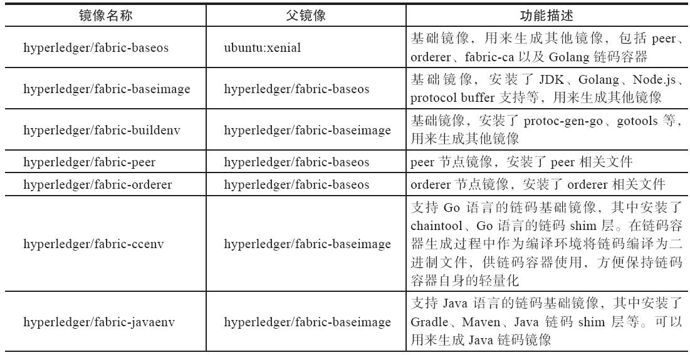
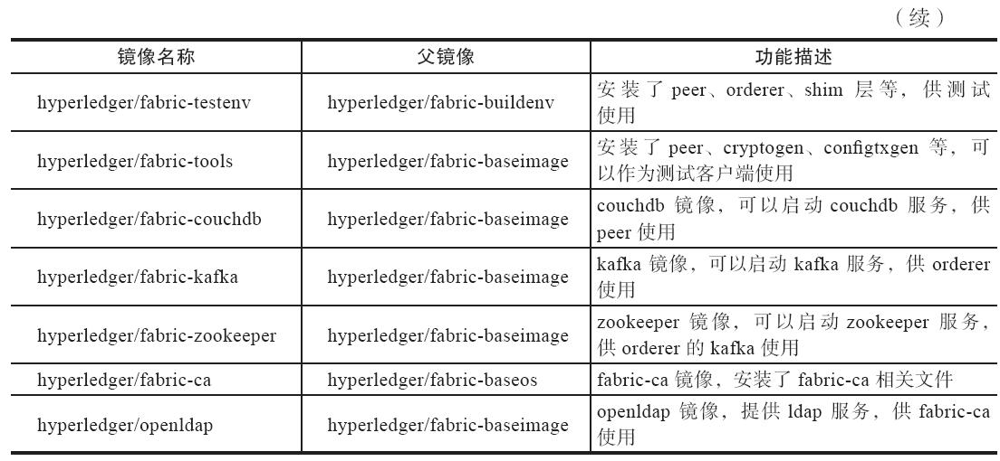
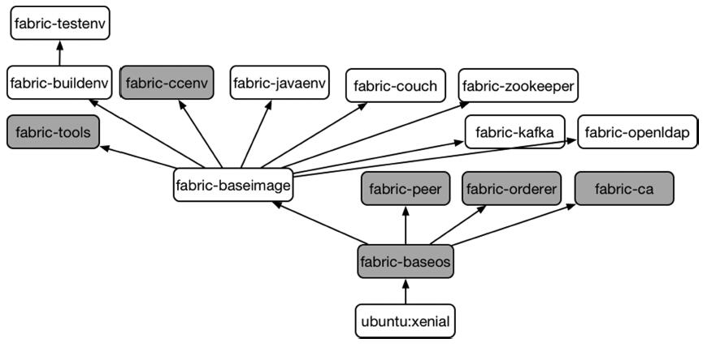
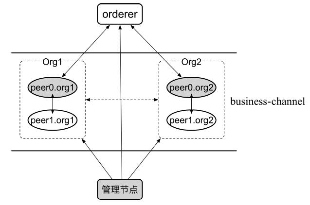
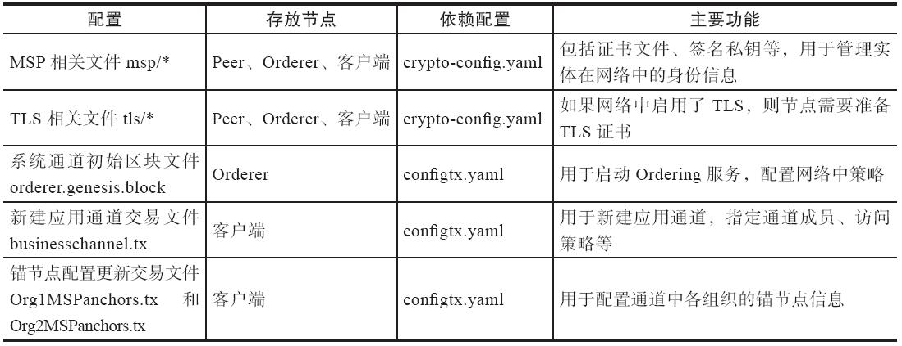
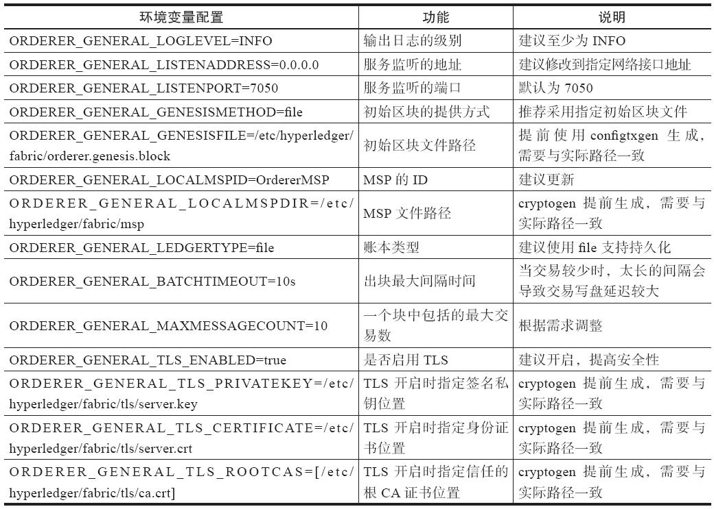
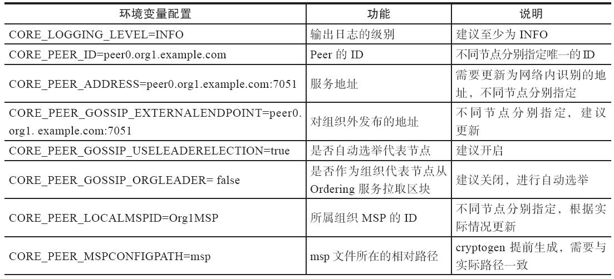
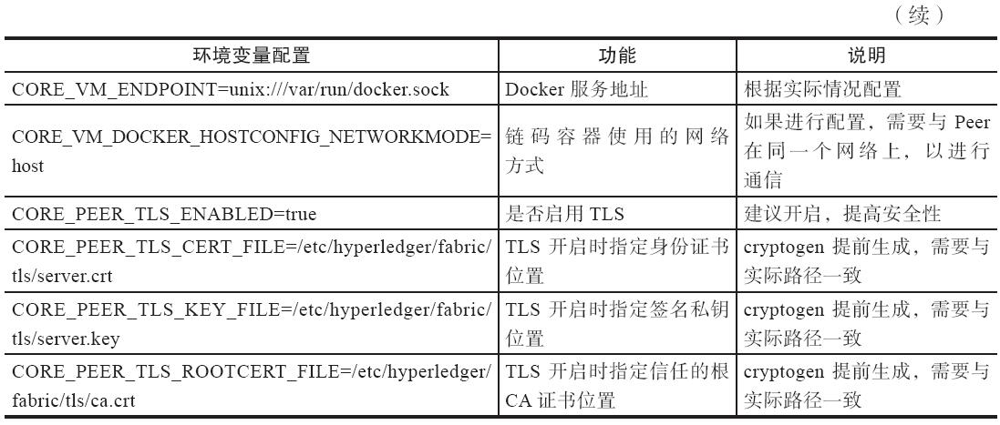

# Setup Fabric 1.0 ENV

### OS Version

    Ubuntu1604 + Fabric 1.0 release

### Core components

    1.    Docker-compose:Docker 容器管理；
    2.    Go lang SDK:Go 语言开发、编译环境；
    3.    Git:git 镜像克隆与提交；
    4.    Rest Client: rest API 测试；

### System environment preparation
    1. sudo apt-get install curl vim
    2. sudo apt-get install git
    3. curl -sSL https://get.daocloud.io/docker | sh
    4. sudo usermod -aG docker hsukk;newgrp - docker
    5. sudo vi /etc/default/docker
    6. DOCKER_OPTS="$DOCKER_OPTS -H tcp://0.0.0.0:2375 -H unix:///var/run/docker.sock --api-cors-header='*'"
    7. curl -sSL https://get.daocloud.io/daotools/set_mirror.sh | sh -s http://5c609c19.m.daocloud.io
    8. sudo service docker restart
    9. sudo systemctl enable docker.service
    10. sudo apt-get install python-pip
    11. pip install docker-compose
### Setup GoLang

    1.    wget https://storage.googleapis.com/golang/go1.8.1.linux-amd64.tar.gz
    2.    tar -xzvf go1.8.1.linux-amd64.tar.gz
    3.    mv ./go  /usr/local
    4.    vim /etc/profile
            export GOROOT=/usr/local/go
            export PATH=$PATH:$GOROOT/bin
    5.    source /etc/profile

### Setup Fabric 1.0 environment preparation

        1.    vim ~/.bashrc
                    export GOPATH=/home/hsukk/fabric
        2.    source ~/.bashrc
        4.    mkdir -p /home/hsukk/fabric/src/github.com/hyperledger
        5.    cd $GOPATH/src/github.com/hyperledger
        6.    git clone https://github.com/hyperledger/fabric.git
### Make gotools

        1.    mkdir -p  $GOPATH/src/github.com/hyperledger/fabric/gotools/build/gopath/src/golang.org/x/
        2. cd $GOPATH/src/github.com/hyperledger/fabric/gotools/build/gopath/src/golang.org/x/
        3.    git clone https://github.com/golang/tools
        4.    cd $GOPATH/src/github.com/hyperledger/fabric
        5.    make gotools
### Make Docker（Base）

        1.    cd $GOPATH/src/github.com/hyperledger/fabric
        2.    make docker
### >>>Not found proto-gen-go

        1.    cd $GOPATH/src/github.com/hyplerledger/fabric
        2.    cp -rf gotools/build/gopath/bin/protoc-gen-go ./build/docker/gotools/bin/
### Make docker (Fabric CA)

        1.    cd $GOPATH/src/github.com/hyperledger/fabric/
        2.    git clone https://github.com/hyperledger/fabric-ca.git
        3.    cd fabric-ca
        4.    make docker


### Docker Example



### Docker Required





### Start Fabric (可用于物理机)

1. 生成组织关系和身份证书

* crypto-config.yaml配置文件的结构十分简单，支持定义两种类型（OrdererOrgs和PeerOrgs）的若干组织。每个组织中又可以定义多个节点（Spec）和用户（User）。
* 一个示例的crypto-config.yaml配置文件内容如下，其中定义了一个OrdererOrgs类型的组织Orderer（包括一个节点orderer.example.com），以及两个PeerOrgs类型的组织Org1和Org2（分别包括2个节点和1个普通用户）。

```
OrdererOrgs:
  - Name: Orderer
    Domain: example.com
    Specs:
      - Hostname: orderer
PeerOrgs:
  - Name: Org1
    Domain: org1.example.com
    Template:
      Count: 2
    Users:
      Count: 1
  - Name: Org2
    Domain: org2.example.com
    Template:
      Count: 2
    Users:
      Count: 1
```






* 使用该配置文件，通过如下命令可以为Fabric网络生成指定拓扑结构的组织和身份文件，存放到crypto-config目录下：
* $ cryptogen generate --config=./crypto-config.yaml --output ./crypto-config
* 查看crypto-config目录结构，按照示例crypto-config.yaml中的定义进行生成：
* tree -L 4 crypto-config

```
./
├── ordererOrganizations
│   └── example.com
│       ├── ca
│       │   ├── 7040930a3e2ebc9cf7456db26e4312613e7a32aae1ef8c24a48f24d4b47229cd_sk
│       │   └── ca.example.com-cert.pem
│       ├── msp
│       │   ├── admincerts
│       │   ├── cacerts
│       │   └── tlscacerts
│       ├── orderers
│       │   └── orderer.example.com
│       ├── tlsca
│       │   ├── 3923698f9d31f0647d4d2406d2540d82b8c81a6a5b917b326ded807995c0b956_sk
│       │   └── tlsca.example.com-cert.pem
│       └── users
│           └── Admin@example.com
└── peerOrganizations
    ├── org1.example.com
    │   ├── ca
    │   │   ├── ca.org1.example.com-cert.pem
    │   │   └── f5b5519a38778536fee5faf92a7ca4e0feb8f001552065d2d48cfa4e4a35b337_sk
    │   ├── msp
    │   │   ├── admincerts
    │   │   ├── cacerts
    │   │   └── tlscacerts
    │   ├── peers
    │   │   ├── peer0.org1.example.com
    │   │   └── peer1.org1.example.com
    │   ├── tlsca
    │   │   ├── 9169faf189763964d2770653a36146e8524fa880dd4e7d9b6988c2d82cc91409_sk
    │   │   └── tlsca.org1.example.com-cert.pem
    │   └── users
    │       ├── Admin@org1.example.com
    │       └── User1@org1.example.com
    └── org2.example.com
        ├── ca
        │   ├── 10a836ff0db252694dfe1be569d3eb93a594a49d5aee2a5dafa50506b58027b7_sk
        │   └── ca.org2.example.com-cert.pem
        ├── msp
        │   ├── admincerts
        │   ├── cacerts
        │   └── tlscacerts
        ├── peers
        │   ├── peer0.org2.example.com
        │   └── peer1.org2.example.com
        ├── tlsca
        │   ├── d60845501e6c55dffa40fef78ee0467a61f055fb25a5e6de08dffd2877dcb639_sk
        │   └── tlsca.org2.example.com-cert.pem
        └── users
            ├── Admin@org2.example.com
            └── User1@org2.example.com
```

* 按照crypto-config.yaml中的定义，所生成的crypto-config目录下包括多级目录结构。其中ordererOrganizations下包括构成Orderer组织（1个Orderer节点）的身份信息；peerOrganizations下为所有的Peer节点组织（2个组织，4个节点）的相关身份信息。其中最关键的是msp目录，代表了实体的身份信息。
* 对于Orderer节点来说，需要将crypto-config/ordererOrganizations/example.com/orderers/orderer.example.com目录下的内容（包括msp和tls两个子目录）复制到Orderer节点的/etc/hyperledger/fabric路径（与Orderer自身配置一致）下。
* 对于Peer节点来说，则需要复制peerOrganizations下对应的身份证书文件。以org1的peer0为例，将crypto-config/peerOrganizations/org1.example.com/peers/peer0.org1.example.com目录下的内容（包括msp和tls）复制到Peer0节点的/etc/hyperledger/fabric（与Peer自身配置一致）路径下。
* 对于客户端节点来说，为了方便操作，可将完整的crypto-config目录复制到/etc/hyperledger/fabric（与configtx.yaml中配置一致）路径下。

2. 生成Ordering服务启动初始区块
* Orderer节点在启动时，可以指定使用提前生成的初始区块文件作为系统通道的初始配置。初始区块中包括了Ordering服务的相关配置信息以及联盟信息。初始区块可以使用configtxgen工具进行生成。生成过程需要依赖/etc/hyperledger/fabric/configtx.yaml文件。configtx.yaml配置文件定义了整个网络中的相关配置和拓扑结构信息。
* 编写configtx.yaml配置文件可以参考Fabric代码中（如examples/e2e_cli路径下或sampleconfig路径下）的示例。这里采用如下内容进行生成：
```
---
Profiles:

    TwoOrgsOrdererGenesis:
        Orderer:
            <<: *OrdererDefaults
            Organizations:
                - *OrdererOrg
        Consortiums:
            SampleConsortium:
                Organizations:
                    - *Org1
                    - *Org2
    TwoOrgsChannel:
        Consortium: SampleConsortium
        Application:
            <<: *ApplicationDefaults
            Organizations:
                - *Org1
                - *Org2

Organizations:

    - &OrdererOrg
        Name: OrdererOrg

        ID: OrdererMSP

        MSPDir: crypto-config/ordererOrganizations/example.com/msp

    - &Org1
        Name: Org1MSP

        ID: Org1MSP

        MSPDir: crypto-config/peerOrganizations/org1.example.com/msp

        AnchorPeers:
            - Host: peer0.org1.example.com
              Port: 7051

    - &Org2
        Name: Org2MSP

        ID: Org2MSP

        MSPDir: crypto-config/peerOrganizations/org2.example.com/msp

        AnchorPeers:
            - Host: peer0.org2.example.com
              Port: 7051

Orderer: &OrdererDefaults

    OrdererType: solo

    Addresses:
        - orderer.example.com:7050

    BatchTimeout: 2s

    BatchSize:

        MaxMessageCount: 10

        AbsoluteMaxBytes: 98 MB

        PreferredMaxBytes: 512 KB

    Kafka:
        Brokers:
            - 127.0.0.1:9092

    Organizations:

Application: &ApplicationDefaults

    Organizations:
```
* 该配置文件定义了两个模板：TwoOrgsOrdererGenesis和TwoOrgsChannel，其中前者可以用来生成Ordering服务的初始区块文件。
* 通过如下命令指定使用configtx.yaml文件中定义的TwoOrgsOrdererGenesis模板，来生成Ordering服务系统通道的初始区块文件。注意这里排序服务类型采用了简单的solo模式，生产环境中可以采用kafka集群服务：
* $ configtxgen -profile TwoOrgsOrdererGenesis -outputBlock ./orderer.genesis.block
* 所生成的orderer.genesis.block需要复制到Orderer节点上（与Orderer配置中ORDERER_GENERAL_GENESISFILE指定文件路径一致，默认放到/etc/hyperledger/fabric路径下），在启动Orderering服务时进行使用。

3. 生成新建应用通道的配置交易
* 新建应用通道时，需要事先准备好配置交易文件，其中包括属于该通道的组织结构信息。这些信息会写入该应用通道的初始区块中。
* 同样需要提前编写好configtx.yaml配置文件，之后可以使用configtxgen工具来生成新建通道的配置交易文件。
* 为了后续命令使用方便，将新建应用通道名称businesschannel复制到环境变量CHANNEL_NAME中：

```
$ CHANNEL_NAME=businesschannel
之后采用如下命令指定使用configtx.yaml配置文件中的TwoOrgsChannel模板，来生成新建通道的配置交易文件。TwoOrgsChannel模板指定了Org1和Org2都属于后面新建的应用通道：
$ configtxgen -profile TwoOrgsChannel -outputCreateChannelTx ./businesschannel.
tx -channelID ${CHANNEL_NAME}
所生成的配置交易文件会在后续步骤被客户端使用，因此可以放在客户端节点上。
```

4. 生成锚节点配置更新文件
* 锚节点配置更新文件可以用来对组织的锚节点进行配置。
* 同样基于configtx.yaml配置文件，可以通过如下命令使用configtxgen工具来生成新建通道文件。每个组织都需要分别生成，注意需要分别指定对应的组织名称：

```
$ configtxgen -profile TwoOrgsChannel -outputAnchorPeersUpdate ./Org1MSPanchors.tx -channelID ${CHANNEL_NAME} -asOrg Org1MSP
$ configtxgen -profile TwoOrgsChannel -outputAnchorPeersUpdate ./Org2MSPanchors.tx -channelID ${CHANNEL_NAME} -asOrg Org2MSP
```
* 所生成的锚节点配置更新文件会在后续步骤被客户端使用，因此可以放在客户端节点上。
* 所有用于启动的配置文件生成并部署到对应节点后，可以进行服务的启动操作，首先要启动Orderer节点，然后启动Peer节点。

### Start Orderer
* 首先，检查启动节点的所有配置是否就绪：
* ·在/etc/hyperledger/fabric路径下放置有编写好的orderer.yaml（可以参考sampleconfig/orderer.yaml）；
* ·在/etc/hyperledger/fabric路径下放置生成的msp文件目录、tls文件目录；
* ·在/etc/hyperledger/fabric路径下放置初始区块文件orderer.genesis.block。
* Orderer节点的默认配置文件中指定了简单的Orderer节点功能。
* 通常情况下，在使用时根据需求往往要对其中一些关键配置进行指定。表9-3总结了如何通过环境变量方式对这些关键配置进行更新。

* orderer start

### Start Peer
* 首先，检查启动所有Peer节点的所有配置是否就绪：
* ·在/etc/hyperledger/fabric路径下放置有对应编写好的core.yaml（可以参考sampleconfig/core.yaml）；
* ·在/etc/hyperledger/fabric路径下放置生成的对应msp文件目录、tls文件目录。
* Peer节点的默认配置文件中指定了适合调试的Peer节点功能。
* 使用时根据需求可能要对其中一些关键配置进行指定。表总结了如何通过环境变量方式对这些关键配置进行更新。


* peer node start

> peer 启动后,默认情况下没有加入网络中的任何应用通道,也不会与orderer服务建立链接.需要通过客户端进行操作,让他加入网络和指定的应用通道.

### Join Network
1. 创建通道
* 使用加入联盟中的组织管理员身份可以创建应用通道。
* 在客户端使用Org1的管理员身份来创建新的应用通道，需要指定msp的ID信息、msp文件所在路径、Orderering服务的tls证书位置，以及网络中Ordering服务地址、应用通道名称和交易文件：

```
$ CHANNEL_NAME=businesschannel
$ CORE_PEER_LOCALMSPID="Org1MSP" \
CORE_PEER_MSPCONFIGPATH=/etc/hyperledger/fabric/crypto-config/peerOrganizations/
org1.example.com/users/Admin@org1.example.com/msp \
peer channel create \
-o orderer.example.com:7050 \
-c ${CHANNEL_NAME} \
-f ./businesschannel.tx \
--tls \
--cafile /etc/hyperledger/fabric/crypto-config/ordererOrganizations/example.com/orderers/orderer.example.com/msp/tlscacerts/tlsca.example.com-cert.pem
```

* 创建通道成功后，会自动在本地生成该应用通道同名的初始区块businesschannel.block文件。只有拥有该文件才可以加入创建的应用通道中。

2. 加入通道
* 应用通道所包含组织的成员节点可以加入通道中。
* 在客户端使用管理员身份依次让组织Org1和Org2中的所有节点都加入新的应用通道，需要指定所操作的Peer的地址，以及通道的初始区块。
* 这里以操作Org1中的peer0节点为例：
```
$ CORE_PEER_LOCALMSPID="Org1MSP" \
CORE_PEER_MSPCONFIGPATH=/etc/hyperledger/fabric/crypto-config/peerOrganizations/
org1.example.com/users/Admin@org1.example.com/msp \
CORE_PEER_ADDRESS=peer0.org1.example.com:7051 \
peer channel join \
-b ${CHANNEL_NAME}.block
Peer joined the channel!
```
* 此时，所操作的Peer连接到该应用通道的Ordering服务上，开始接收区块信息。

3. 更新锚节点配置
* 锚节点负责代表组织与其他组织中的节点进行Gossip通信。
* 使用提前生成的锚节点配置更新文件，组织管理员身份可以更新指定应用通道中组织的锚节点配置。
* 这里在客户端使用了Org1的管理员身份来更新锚节点配置，需要指定msp的ID信息、msp文件所在路径、Ordering服务地址、所操作的应用通道、锚节点配置更新文件，以及Orderering服务tls证书位置：
```
$ CORE_PEER_LOCALMSPID="Org1MSP" \
CORE_PEER_MSPCONFIGPATH=/etc/hyperledger/fabric/crypto-config/peerOrganizations/
org1.example.com/users/Admin@org1.example.com/msp \
peer channel update \
-o orderer.example.com:7050 \
-c ${CHANNEL_NAME} \
-f ./Org1MSPanchors.tx \
--tls \
--cafile /etc/hyperledger/fabric/crypto-config/ordererOrganizations/example.
com/orderers/orderer.example.com/msp/tlscacerts/tlsca.example.com-cert.pem
```

4. 测试链码
* Peer加入应用通道后，可以执行链码相关操作，进行测试。链码在调用之前，必须先经过安装（Install）和实例化（Instantiate）两个步骤，部署到Peer节点上。
* 通过如下命令在客户端安装示例链码chaincode_example02到Org1的Peer0上：
```
$ CORE_PEER_LOCALMSPID="Org1MSP" \
CORE_PEER_MSPCONFIGPATH=/etc/hyperledger/fabric/crypto-config/peerOrganizations/
org1.example.com/users/Admin@org1.example.com/msp \
CORE_PEER_ADDRESS=peer0.org1.example.com:7051 \
peer chaincode install \
-n test_cc \
-v 1.0 \
-p github.com/hyperledger/fabric/examples/chaincode/go/chaincode_example02
```
* 通过如下命令将链码容器实例化，并注意通过-P指定背书策略。此处OR（'Org1MSP.member'，'Org2MSP.member'）代表Org1或Org2的任意成员签名的交易即可调用该链码：
```
$ CORE_PEER_LOCALMSPID="Org1MSP" \
CORE_PEER_MSPCONFIGPATH=/etc/hyperledger/fabric/crypto-config/peerOrganizations/
org1.example.com/users/Admin@org1.example.com/msp \
CORE_PEER_ADDRESS=peer0.org1.example.com:7051 \
peer chaincode instantiate \
-o orderer.example.com:7050 \
-C ${CHANNEL_NAME} \
-n test_cc \
-v 1.0 \
-c '{"Args":["init","a","100","b","200"]}' \
-P "OR ('Org1MSP.member','Org2MSP.member')" \
--tls \
--cafile /etc/hyperledger/fabric/crypto-config/ordererOrganizations/example.com/
orderers/orderer.example.com/msp/tlscacerts/tlsca.example.com-cert.pem
```
* 实例化完成后，用户即可向网络中发起交易了。例如，可以通过如下命令来调用链码：
```
$ CORE_PEER_LOCALMSPID="Org1MSP" \
CORE_PEER_MSPCONFIGPATH=/etc/hyperledger/fabric/crypto-config/peerOrganizations/
org1.example.com/users/Admin@org1.example.com/msp \
CORE_PEER_ADDRESS=peer0.org1.example.com:7051 \
peer chaincode invoke \
-o orderer.example.com:7050  \
-C $CHANNEL_NAME \
-n test_cc \
-c '{"Args":["invoke","a","b","10"]}' \
--tls \
--cafile /opt/gopath/src/github.com/hyperledger/fabric/peer/crypto/ordererOrganizations/
example.com/orderers/orderer.example.com/tlscacerts/tlsca.example.com-
cert.pem
```
* 通过如下命令查询调用链码后的结果：
```
$ CORE_PEER_LOCALMSPID="Org1MSP" \
CORE_PEER_MSPCONFIGPATH=/etc/hyperledger/fabric/crypto-config/peerOrganizations/
org1.example.com/users/Admin@org1.example.com/msp \
CORE_PEER_ADDRESS=peer0.org1.example.com:7051 \
peer chaincode query \
-n test_cc \
-C ${CHANNEL_NAME} \
-c '{"Args":["query","a"]}'
Query Result: 90
```

5. 监听事件
* 用户也可以通过block-listener工具来监听网络中的事件。该工具支持的命令行选项包括如下几个：
* ·-events-address"0.0.0.0：7053"：监听事件的来源地址，一般为Peer节点的7053端口；
* ·-events-from-chaincode string：仅监听与指定链码相关的事件；
* ·-events-mspdir string：本地所使用的MSP路径，默认在sampleconfig下；
* ·-events-mspid string：所使用的MSP的ID。
* 例如，用户可以通过如下命令在客户端节点上监听peer0.org1节点的事件：
```
$ block-listener \
-events-address=peer0.org1.example.com:7053 \
-events-mspdir=/etc/hyperledger/fabric/crypto-config/peerOrganizations/org1.
example.com/peers/peer0.org1.example.com/msp/ \
-events-mspid=Org1MSP
```
* 之后，网络中发生的相关事件（区块、交易、注册、拒绝等）会打印出来
> 注意　目前，block-listener工具不支持TLS，因此相关Peer配置需要指定CORE_PEER_TLS_ENABLED=false。

6. Fabric in Docker
* ./network_setup.sh up mytestchannel


### 配置解读
1. core.yaml
2. crypto-config.yaml
3. orderer.yaml
>以上参考配置文件解读。
