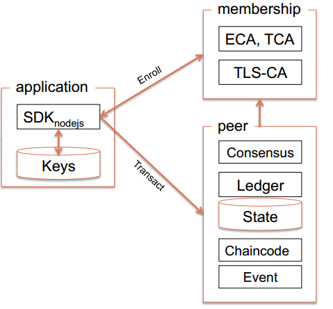
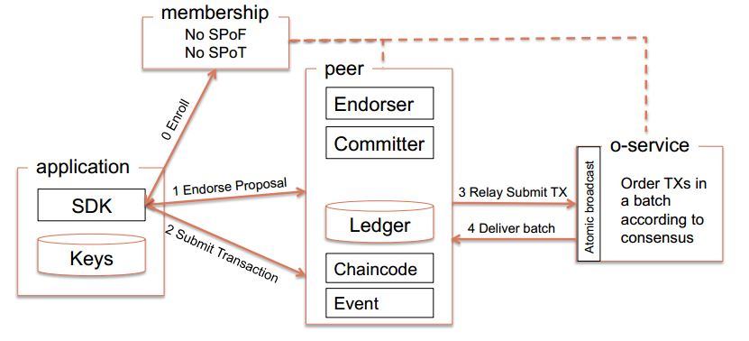
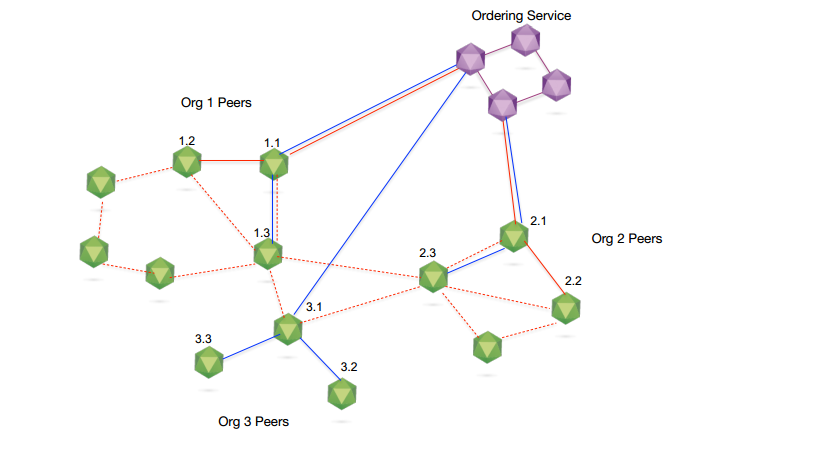
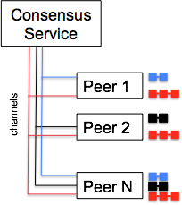
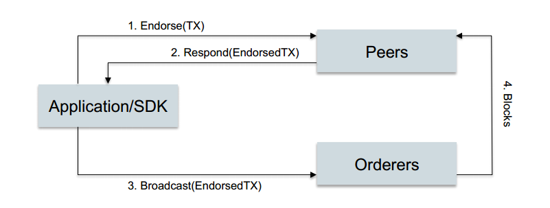
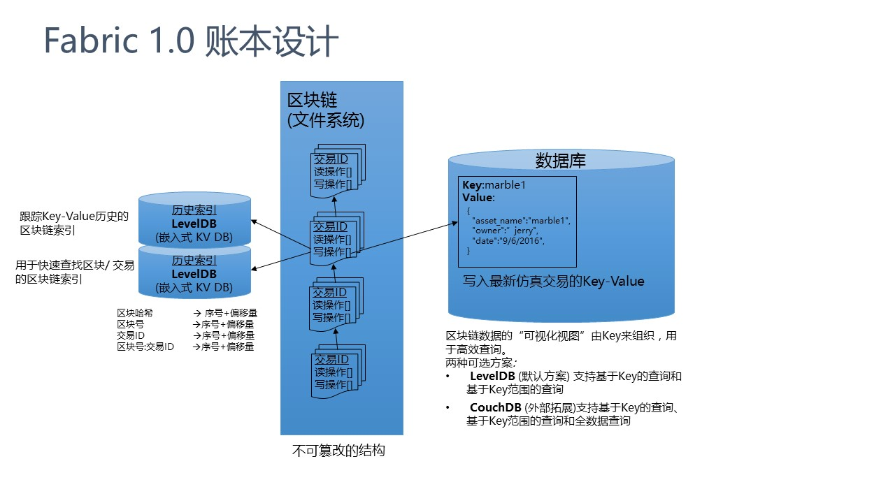

# Fabric 1.0 系统设计
Hyperledger是被业界非常看到的联盟链的实现，包括IBM、Intel、R3、各个大型商业银行等都参与其中，带给我们关于区块链技术与软件工业、金融、保险、物流等领域碰撞结合的想象空间；在这个联盟中，有超过1/4的成员都来自中国，这更是我们对于它的一举一动都非常关注。很大程度上，Hyperledger和它背后的联盟体系就代表着区块链在产业环境中的未来。

　　作为最重要的子项目，在联盟推出Fabric 0.6版本后，最新的Fabirc 1.0 版本也即将问世，今天我们来走马观花地领略一下最新版本（1.0）的总体架构，对于这个承载产业梦想的新生事物有个基本的认识。

## Fabric 0.6  VS Fabric 1.0
##### 0.6版本的运行时架构：

##### 0.6版本的架构特点是：

* 结构简单： 应用-成员管理-Peer的三角形关系，主要业务功能全部集中于Peer节点；

* 架构问题：由于peer节点承担了太多的功能，所以带来扩展性、可维护性、安全性、业务隔离等方面的诸多问题，所以0.6版本在推出后，并没有大规模被行业使用，只是在一些零星的案例中进行业务验证；

针对上述问题，1.0版本做了很大的改进和重构：

##### 1.0 架构要点：

* 分拆Peer的功能，将Blockchain的数据维护和共识服务进行分离，共识服务从Peer节点中完全分离出来，独立为Orderer节点提供共识服务；
* 基于新的架构，实现多通道（channel）的结构，实现了更为灵活的业务适应性（业务隔离、安全性等方面）
* 支持更强的配置功能和策略管理功能，进一步增强系统的灵活性和适应性；

`备注：最新的1.0版本中，上图中的Membership服务已经改名为fabric-ca`

##### 1.0版本架构目标
从Fabric的新架构设计的建议文档看，1.0版本的设计目标如下：

* chaincode信任的灵活性：支持多个ordering服务节点，增强共识的容错能力和对抗orderer作恶的能力
* 扩展性： 将endorsement和ordering进行分离，实现多通道（实际是分区）结构，增强系统的扩展性；同时也将chaincode执行、ledger、state维护等非常消耗系统性能的任务与共识任务分离，保证了关键任务（ordering）的可靠执行
* 保密性：新架构对于chaincode在数据更新、状态维护等方面提供了新的保密性要求，提高系统的业务、安全方面的能力
* 共识服务的模块化：支持可插拔的共识结构，支持多种共识服务的接入和服务实现
##### 架构特点
Hyperledger fabirc 1.0 版本的在0.6版本基础上，针对安全、保密、部署、维护、实际业务场景需求等方面进行了很多改进，特别是Peer节点的功能分离，给系统架构具备了支持多通道、可插拔的共识的能力，使得Fabric脱离了0.6版本带给人的青涩感（仅仅是个”验证与演示“版的，呵呵），已经接近于工业应用的需求；

### 1.0版本的关键架构：
##### 多链与多通道
Fabric 1.0 的重要特征是支持多chain和多channel；
所谓的chain（链）实际上是包含Peer节点、账本、ordering通道的逻辑结构，它将参与者与数据（包含chaincode在）进行隔离，满足了不同业务场景下的”不同的人访问不同数据“的基本要求。

同时，一个peer节点也可以参与到多个chain中（通过接入多个channel）；如下图所示

关于通道：通道是有共识服务（ordering）提供的一种通讯机制，类似于消息系统中的发布-订阅（PUB/SUB)中的topic；基于这种发布-订阅关系，将peer和orderer连接在一起，形成一个个具有保密性的通讯链路（虚拟），实现了业务隔离的要求；通道也与账本（ledger）-状态（worldstate）紧密相关；如下图所示：

共识服务与（P1、PN）、（P1、P2、P3）、（P2、P3）组成了三个相互独立的通道，加入到不同通道的Peer节点能够维护各个通道对应的账本和状态；也其实也对应现实世界中，不同业务场景下的参与方，例如银行、保险公司；物流企业、生产企业等实体结构；我们可以看到channel机制实际上是的Fabric建模实际业务流程的能力大大增强了，大家可以发挥想象力去找到可能的应用领域
##### 交易（数据）流程说明
总体流程如下图所示：

* 应用程序通过SDK发送请求道Peer节点（一个或多个）
* peer节点分别执行交易（通过chaincode），但是并不将执行结果提交到本地的账本中（可以认为是模拟执行，交易处于挂起状态），参与背书的peer将执行结果返回给应用程序（其中包括自身对背书结果的签名）
* 应用程序 收集背书结果并将结果提交给Ordering服务节点
* Ordering服务节点执行共识过程并生成block，通过消息通道发布给Peer节点，由peer节点各自验证交易并提交到本地的ledger中（包括state状态的变化）
##### 对应的执行序列图如下：

在新的架构中，Peer节点负责维护区块链的账本（ledger）和状态（State），本地的账本称为PeerLedger，其结构如下：

整个区块结构分为文件系统存储的Block结构和数据库维护的State状态，其中state的存储结构是可以替换的，可选的实现包括各种KV数据库（LEVELDB，CouchDB等）；

`1.0 版本的代码和文档每天都在更新，请大家关注官网和github.`

## Fabric1.0 账本组成

